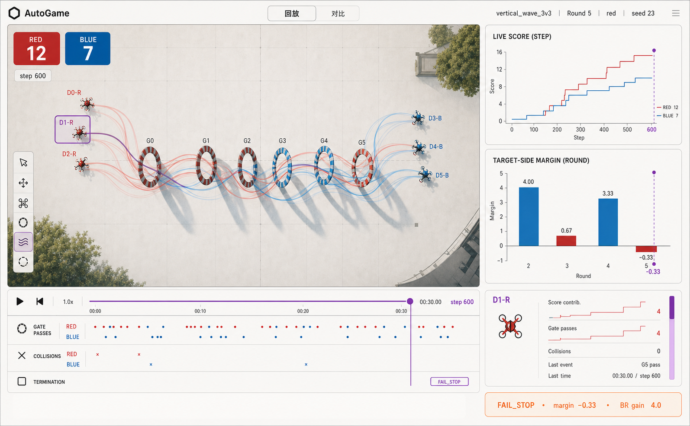
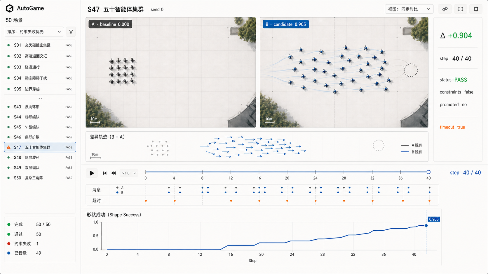

# AutoGame 工作台产品方案 V1

> 状态：待评审
> 产品定位：实验内容优先的游戏智能体研究工作台
> 相关材料：[竞品调研](benchmark-research-v4.md) · [现有状态映射](v2-state-mapping.md)

> 更新：本方案的固定页面与只读边界已由[产品方案 V2](autogame-product-proposal-v2.md)重新定义。V1 保留为评审历史。

## 1. 方案摘要

AutoGame 工作台把当前以 CLI、目录和 JSON 文件为主的研究项目，转化为人可以日常使用的实验产品。

它不是 Agent 控制台，也不要求 Agent 维护任务卡、阶段进度或解释文案。工作台直接读取实验流程已经产生的场景描述、回放帧、事件、指标、对比结果和晋级结论，将它们组织成三个连续的问题：

1. 实验里发生了什么？
2. 相比基线改变了什么？
3. 为什么通过、失败或没有晋级？

产品默认是只读的“实验事实层”。人通过回放、选择、对比和异常定位进入循环；流水线仍然是实验状态的唯一事实来源。

## 2. 背景与问题

项目已经具备较完整的实验基础设施：

- 50 个场景的 suite 运行及汇总结果；
- baseline/candidate 成对评估；
- `FramePacket` 回放数据；
- 场景级 `VisualizationSpec`；
- `replay_index.json`、`comparison.json` 和 `state.json`；
- game round、leaderboard、research state 和实验图表；
- 一个只读 HTTP 服务及静态回放 Viewer。

当前主要缺口不是“缺少更多状态”，而是实验事实彼此割裂：

- 用户需要在多个目录、JSON、CSV 和 PNG 之间寻找结果；
- 回放画面、事件和曲线没有稳定的联动阅读方式；
- baseline 与 candidate 很难在相同时间和视角下比较；
- `PASS`、`constraints_passed=false`、`promoted=false` 等组合缺少直观解释；
- 现有 Viewer 更接近开发验证工具，还不是低门槛的日常产品。

## 3. 产品目标

### 3.1 核心目标

- 用户进入一个场景后，首先看到实验世界和回放，而不是 Agent 操作步骤。
- 回放、图表、事件和实体详情共享同一个时间选择。
- baseline 与 candidate 可以在同一时间、同一视角下比较。
- 结果页只展示能够解释结论的指标和证据。
- 所有状态均来自现有产物或由现有字段即时推导。
- 异常发生时，让人快速定位证据；正常运行时保持界面安静。

### 3.2 非目标

V1 不建设以下能力：

- Agent 任务看板或思维过程直播；
- 由 Agent 维护的产品进度、解释和摘要状态；
- 通用低代码 Dashboard 搭建器；
- 团队审批流、审核队列进度和多人权限系统；
- 云端实验调度平台；
- 人工强制修改实验指标或绕过安全约束。

## 4. 目标用户与核心任务

### 4.1 研究负责人

需要快速判断一次实验是否值得继续、哪一项约束阻止了晋级，以及变化是否真实发生在实验内容中。

### 4.2 场景或策略开发者

需要定位某个时间点、实体、事件或轨迹异常，并把它关联到动作、奖励和指标变化。

### 4.3 结果评审者

不需要理解完整代码结构，但需要通过画面、曲线和对比证据判断结果是否合理。

## 5. 产品原则

### 5.1 实验内容是主界面

空间回放、视频、轨迹、图表和结果数据占据主要画布。导航和控制只为阅读实验服务。

### 5.2 一个事实，一种状态

UI 不复制 suite、scenario、round 或 experiment 状态。文件中的结果是唯一事实，界面只构造临时选择状态，例如当前场景、seed、时间点和选中实体。

### 5.3 时间是统一索引

`scenario_time` 与 `episode_step` 是回放、曲线、事件和实体检查的共同坐标。拖动一次时间线，所有内容同时更新。

### 5.4 对比优先于汇报

展示 baseline、candidate 和 delta，让用户直接看到差异；不依赖 Agent 生成结论段落。

### 5.5 异常才打断人

只有现有结果满足以下条件之一时，界面显示明显的异常入口：

- `status == "FAIL_STOP"`；
- `status == "ERROR"`；
- `constraints_passed == false`。

### 5.6 预设布局优先

用户不需要先搭建面板。场景通过 `VisualizationSpec` 声明世界、图层和默认视角，产品提供可直接使用的布局。

## 6. 产品对象模型

工作台沿用实验产物已经存在的层级：

```text
Project
└── Suite Run / Game
    ├── Scenario / Round
    │   ├── Baseline Replay
    │   ├── Candidate Replay
    │   ├── Frames & Events
    │   └── Metrics & Decision
    └── Artifacts
```

界面不新增“Agent 当前正在理解、计划、执行”等对象。

## 7. 信息架构

V1 包含三个主要界面。

### 7.1 Suite：实验索引

回答：“这 50 个场景中，我应该先看哪一个？”

Suite 不是 Dashboard 终点，而是进入实验内容的索引。每一行只显示：

- scenario ID 与名称；
- task family；
- primary metric；
- baseline；
- candidate；
- delta；
- constraints；
- promoted；
- status。

默认排序规则：

1. `ERROR`；
2. `FAIL_STOP`；
3. `constraints_passed == false`；
4. delta 由低到高；
5. scenario ID。

用户打开一行后进入 Investigate；选择“对比”进入 Compare。

### 7.2 Investigate：实验调查

回答：“实验里具体发生了什么？”



#### 页面布局

- 顶部：项目、scenario、role、seed 和投影视角；
- 中央：占主要面积的 2D/3D 空间回放；
- 右侧：主指标曲线与最多两个结论相关图表；
- 底部：唯一播放时间线、事件轨道和终止点；
- 选中实体后：显示该实体的轨迹、动作、奖励和最近事件；
- 异常时：显示一条紧凑的异常证据条。

#### 核心交互

- 播放、暂停、单步和拖动时间；
- 2D/3D 视角切换；
- 开关 entities、goals、trajectories、relations、fields、events、messages 图层；
- 点击实体后跨画面和图表联动高亮；
- 点击事件跳转到对应帧；
- 点击曲线位置跳转到对应时间；
- 复制当前深链接，保留 scenario、role、seed、step 和 entity 选择。

### 7.3 Compare：基线与候选对比

回答：“候选策略到底改变了什么？”



#### 页面布局

- 左侧：Suite 场景索引，异常优先；
- 中央上方：baseline 与 candidate 两个同步空间回放；
- 中央中部：差异轨迹或叠加视图；
- 中央下方：共享时间线、事件轨道和主指标曲线；
- 右侧：baseline、candidate、delta、status、constraints 和 promoted。

#### 同步规则

- 两侧默认使用相同 camera、projection、seed 和 step；
- 时间以 episode step 对齐，必要时显示各自的 `scenario_time`；
- Plot 同时显示两条曲线和当前时间游标；
- 事件轨道保留来源标识 A/B；
- 差异视图由两侧实体位置或指标即时计算，不写入实验状态。

#### S47 真实结果示例

- `baseline_mean = 0.000`；
- `candidate_mean = 0.9041496`；
- `delta = +0.9041496`；
- `status = PASS`；
- `constraints_passed = false`；
- `promoted = false`。

界面应同时呈现“主指标显著提升”和“约束未通过”，而不是用单一红色或绿色状态掩盖这种组合。

## 8. 图表与视频设计规则

### 8.1 默认内容

每个可执行场景无需额外配置即可获得：

- `primary_metric` 随时间变化曲线；
- collision、out-of-bounds、action violation 等现有约束指标；
- event type 时间分布；
- 实体位置、目标和轨迹；
- baseline/candidate 最终值与 delta。

### 8.2 场景声明内容

`VisualizationSpec` 决定：

- 世界维度、边界、单位和轴；
- 静态几何；
- 默认 2D/3D 视角；
- 可用图层及默认显隐；
- 场景披露信息。

### 8.3 视频与导出

V1 的“视频”首先是浏览器中的可交互回放。后续导出能力包括：

- 当前 replay 导出 MP4；
- 当前时间区间导出 GIF；
- Compare 双栏导出视频；
- 当前画面与结果导出 PNG；
- 将场景、seed、时间和实体选择写入导出元数据。

导出是回放的呈现形式，不是新的实验状态。

## 9. Human-in-the-loop 设计

### 9.1 V1 的含义

V1 中的 Human-in-the-loop 是“人能够看到、定位和验证实验事实”，不是增加一套人工审批状态。

正常场景不显示审核操作。异常场景提供：

- 跳转终止帧；
- 跳转首次约束失败事件；
- 查看 baseline/candidate 对比；
- 查看原始 comparison、metrics 和 replay 证据；
- 生成带当前上下文的重跑命令或打开现有运行入口。

### 9.2 V1 不做人工覆盖

V1 不直接提供“忽略约束并强制晋级”。如果未来需要人工覆盖，必须先定义可审计的覆盖契约、操作者、理由和不可变历史；不能静默修改现有 `promoted`。

## 10. 现有数据映射

| 产品内容 | 现有来源 | 关键字段 |
|---|---|---|
| Suite 状态 | `suite_runs/*/state.json` | `status`, `scenario_count`, `completed_count` |
| 场景索引 | `state.json.scenarios` | `scenario_id`, `name`, `task_family` |
| 对比结果 | `state.json`, `comparison.json` | `baseline_mean`, `candidate_mean`, `delta` |
| 结论 | `state.json` | `status`, `constraints_passed`, `promoted` |
| 回放目录 | `replay_index.json` | `policy_role`, `seed`, `path`, `frame_count`, `duration` |
| 世界与图层 | `descriptor.json`, `visualization.yaml` | `world`, `static_primitives`, `dynamic_layers`, `views` |
| 时间 | `FramePacket` | `scenario_time`, `episode_step` |
| 空间画面 | `FramePacket` | `entities`, `relations`, `fields` |
| 实体检查 | `FramePacket` | `observations`, `actions`, `messages`, `rewards` |
| 事件轨道 | `FramePacket.events` | `event_type`, `step`, `time`, `participants`, `attributes` |
| 曲线 | `FramePacket.metrics` | `primary_metric`, `primary_value`, constraint metrics |
| Game 轮次 | `game/*/round_history.json` | `round_id`, `target_side`, utility, margin, constraints |
| Research 阶段 | `experiments/*/research_state.json` | `stage`, `history` |

## 11. 技术方案

### 11.1 当前基础

仓库已经存在：

- `RunRepository`：在 suite root 内提供安全、只读的 artifact 访问；
- `/api/scenarios`、descriptor、visualization、replay index 和分页 frames API；
- 只拒绝写操作的 HTTP 服务；
- 静态 HTML/CSS/JavaScript Viewer；
- Canvas 场景渲染、播放、图层、role/seed/projection 选择；
- repository、service 和 visualization 测试。

因此 V1 应在现有 Viewer 上演进，不先重写整个前端。

### 11.2 建议架构

```text
Existing artifacts
      │
      ▼
RunRepository ── read-only aggregation ── Workbench API
      │                                      │
      ├── descriptor / visualization         ├── suite view model
      ├── replay index / frames              ├── investigate view model
      ├── state / comparison                  └── compare view model
      └── round / experiment artifacts
                                             │
                                             ▼
                                   AutoGame Workbench UI
                                   ├── spatial renderer
                                   ├── time coordinator
                                   ├── plots and event lanes
                                   └── evidence inspector
```

View model 是请求时生成的只读数据，不落盘为新的产品状态。

### 11.3 API 增量

建议增加：

- `GET /api/run`：suite 元数据与汇总；
- `GET /api/results`：有序 scenario 结果列表；
- `GET /api/scenarios/{id}/comparison`：场景 comparison；
- `GET /api/scenarios/{id}/series?role=&seed=`：从 frames 聚合图表序列；
- `GET /api/scenarios/{id}/evidence?role=&seed=&step=`：选中帧的实体和事件证据；
- `GET /api/games/{id}/rounds`：后续接入 round history。

所有接口保持只读、路径约束和输入校验。

### 11.4 Rerun 技术验证

不立即替换现有 renderer。单独完成一个受限 Spike：

1. 把一个 `FramePacket` replay 转换为 Rerun recording；
2. 映射 entities、goals、trajectories、relations、events 和 metrics；
3. 在 Web Viewer 中加载 recording；
4. 验证时间变化和实体选择回调；
5. 验证能否嵌入 AutoGame 外壳并隐藏复杂配置；
6. 比较包体、启动时间、内存、2D/3D 表现和维护成本。

通过 Spike 后，Rerun 可成为空间和时间渲染内核；Suite、Compare 结论和 Human-in-the-loop 仍由 AutoGame 控制。

## 12. MVP 范围

### P0：必须完成

- Suite 读取真实 `state.json`，显示 50 个场景结果；
- Investigate 的空间回放、统一时间线和主指标曲线；
- 事件标记与时间跳转；
- baseline/candidate 同步 Compare；
- constraints 与 promoted 组合展示；
- 异常证据条；
- URL 深链接；
- 对真实 S47 和 representative scenarios 的回归测试；
- 保持 API 只读。

### P1：紧随其后

- 实体跨视图选择与检查；
- reward/action/message/event 联动；
- 2D/3D 保存视角；
- PNG、GIF、MP4 导出；
- round history 调查页；
- Rerun Spike。

### P2：确认需求后

- 多次 suite run 比较；
- 可保存但不改变实验状态的个人布局；
- 分享与评论；
- 可审计的人工决定契约；
- 远程存储和多人工作区。

## 13. 验收标准

### 13.1 产品验收

用户无需打开文件目录即可回答：

1. 当前场景发生了什么？
2. 哪个时间点出现关键事件？
3. candidate 相对 baseline 改变了什么？
4. 哪项指标或约束决定了结果？
5. 为什么场景通过但没有晋级？

### 13.2 数据验收

- UI 中不存在无法追溯到 artifact 字段的持久状态；
- Suite 数量、PASS、constraints 和 promoted 与 `state.json` 完全一致；
- 时间游标使用 replay 中的 step/time；
- 图表值可以追溯到对应 frame 或 comparison；
- 缺失字段显示“无数据”，不推测结果；
- S47 必须显示 50 PASS、49 promoted、1 constraint failure。

### 13.3 交互验收

- 拖动时间线后，空间画面、曲线游标和事件选择同步；
- 从事件跳帧和从曲线跳帧结果一致；
- Compare 两侧保持同 seed、step 和 camera；
- 50 个场景无需逐个编写 UI 配置；
- 页面没有说明性长段落和 Agent 进度卡。

### 13.4 工程验收

- 现有 repository 边界和路径逃逸防护不退化；
- POST、PUT、PATCH、DELETE 继续被拒绝；
- 新 API 有 unit tests；
- Viewer 在无网络条件下可本地运行；
- legacy replay fallback 保持可用。

## 14. 实施顺序

### Iteration 1：统一结果入口

- 扩展 `RunRepository` 读取 `state.json` 和 `comparison.json`；
- 完成 Suite 真实结果索引；
- 建立共享 view model 和深链接参数。

### Iteration 2：Investigate

- 把现有 Viewer 收敛为内容优先布局；
- 增加主指标曲线和事件轨道；
- 建立统一 time coordinator；
- 增加异常证据条。

### Iteration 3：Compare

- 成对加载 baseline/candidate；
- 同步时间、camera 和 Plot；
- 实现 delta 与约束结果；
- 用 S47 完成端到端验收。

### Iteration 4：实体检查与导出

- 实体联动选择；
- 动作、奖励、消息与事件检查；
- PNG/GIF/MP4 导出；
- round history 接入。

### Parallel Spike：Rerun

在不影响现有 Viewer 的前提下评估 Rerun。只有当它能减少渲染维护成本且不把复杂度暴露给用户时才进入主产品。

## 15. 成功指标

早期不使用 DAU 等规模指标，先衡量诊断效率：

- 找到关键失败帧的时间；
- 完成 baseline/candidate 判断的时间；
- 为理解一个结果而手动打开的 artifact 文件数量；
- 可从 UI 直接定位的 constraint failure 比例；
- UI 与 artifact 状态不一致的缺陷数，目标为 0；
- 50 个场景中无需特殊 UI 代码即可正确呈现的比例。

## 16. 风险与控制

| 风险 | 控制方式 |
|---|---|
| 做成新的通用 Dashboard | 固定三种产品界面，不开放任意面板搭建 |
| UI 状态与实验状态分叉 | 只读 artifact，view model 不落盘 |
| 每个场景需要 Agent 写可视化 | 使用 VisualizationSpec 和通用 FramePacket 映射 |
| 图表数量再次造成认知负荷 | 默认只显示主指标、约束和当前选择相关内容 |
| Rerun 引入较大依赖和复杂 UI | 先 Spike，AutoGame 控制外壳和默认布局 |
| baseline/candidate 时间长度不同 | step 对齐并明确显示各自 scenario_time |
| 人工操作绕过安全结论 | V1 不提供强制晋级 |
| 回放数据过大 | 分页 frames、序列聚合、按需加载和下采样 |

## 17. 待产品负责人确认

请重点审核以下决策：

- [ ] 产品定位是否确认：实验工作台，而不是 Agent 控制台？
- [ ] V1 是否确认保持只读，不加入人工强制晋级？
- [ ] 是否确认先以 Suite Run 为首个完整入口，Game Round 在 P1 接入？
- [ ] 是否确认在现有静态 Viewer 上迭代，而不是立即重写 React 前端？
- [ ] 是否批准独立进行 Rerun Spike，但不预设一定采用？
- [ ] 是否确认 V1 的三个主界面：Suite、Investigate、Compare？
- [ ] 是否需要把 MP4 导出从 P1 提升到 P0？

## 18. 建议结论

建议批准以下基线：

1. 以现有只读 Viewer 为工程起点；
2. 先完成 Suite → Investigate → Compare 的闭环；
3. UI 仅使用现有 artifact 与实时派生 view model；
4. 以 S47 的“指标提升但约束失败”作为首个产品验收案例；
5. Rerun 只做可替换的渲染内核验证，不承担 AutoGame 的产品模型。
